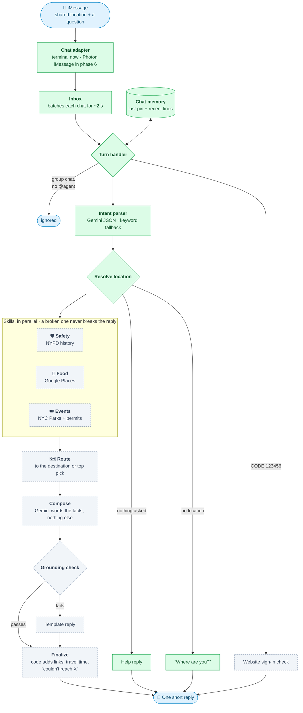

# Around Us: build plan from a new repo

Status: **plan** (2026-09-29). 

This is how we would build Around Me again from an empty repo, in the order it should be built. It keeps the design that worked in `mvp/` and drops what didn't: DeepSpace, the split agent/backend and the three copies of user data.

## 1. What we're building

One iMessage agent for NYC. A person shares a location and asks something. They get one short reply containing:
- a real place or event,
- historical safety context with its source,
- a travel time,
- a Google Maps link.

| Message | Skills |
|---|---|
| "Is it safe around me?" | safety |
| "Where should we get dinner?" | food |
| "What fun stuff is nearby tonight?" | events |
| "How do I get to Jin Ramen?" | route |
| "Plan a fun and safe night near Columbia" | events + food + safety, then route to the top pick |

**Rules that shape everything:**

- **Gemini never invents facts.** It only turns a message into a structured request and words a reply from facts the skills returned. Code checks the reply and adds every link and travel time itself.
- **One broken skill never breaks the reply.** It becomes "couldn't reach X" and the rest still answers.
- **Only the chat adapter sends messages.** Skills never do.
- **Safety is historical NYPD complaint counts,** never a "safe/unsafe" verdict.
- **Location is required.** Without one, the agent asks once and calls no skills.

**Not in scope:** payments, wallets, voice, long-term memory beyond the last location and recent lines, and more than one bot.

### How a message flows



Green boxes are built (phases 1–3); dashed grey boxes are still to come. Sections 5 and 7 have the detailed versions.

## 2. Stack

| Layer | Choice | Why |
|---|---|---|
| Language | TypeScript on Node 22, npm workspaces | One language for agent, skills and API |
| Contracts | zod | Validates Gemini output, skill input and config with one schema each |
| Turn orchestration | LangGraph (`@langchain/langgraph`) | Parallel fan-out to skills and a readable graph. A plain async function would also work. |
| LLM | Gemini via `@google/genai`, JSON mode with a zod schema | Intent parsing, food re-ranking, reply wording |
| Chat | Photon Spectrum (`spectrum-ts`), iMessage | The real user interface |
| Data | Tiger (Timescale Postgres): NYPD complaints, city events, app tables | Time-series queries for safety, one database for everything |
| Places / routes | Google Places API (New), Routes API | Factual restaurants, geocoding, real travel times |
| Web API | Hono on `@hono/node-server`, same process as the agent | Website sign-in without a second backend |
| Email | Resend | Sign-in codes |
| Website | TanStack Start + React + Tailwind, Bun | Sign-up and onboarding pages |
| Tests / lint | Vitest, Biome | Fast, no network in unit tests |
| Hosting | Docker Compose on one DigitalOcean droplet, Caddy for HTTPS; website on Vercel | One long-running process for the Photon listener |

## 3. Repo layout

```text
around-me/
├── packages/
│   ├── core/            contracts, config, flags, Gemini client, pg, logger, time, geo
│   ├── router/          intent parser, dispatcher, turn graph, composer, grounding check
│   ├── skills/
│   │   ├── safety/      NYPD history from Tiger
│   │   ├── events/      NYC Parks + permitted events from Tiger
│   │   ├── food/        Google Places + Gemini re-rank
│   │   └── route/       Google Routes + Maps link
│   └── accounts/        website sign-in (email code + text-to-verify)
├── apps/
│   ├── agent/           chat adapters, batching, chat memory, HTTP API, /healthz, main.ts
│   └── ingest/          scheduled jobs that load NYPD and events data into Tiger
├── web/                 the website
├── sql/                 numbered, additive migrations
├── deploy/              compose.yaml, Caddyfile, deploy.sh
└── .env.example
```

**Dependency rule:** skills import only `@aroundus/core` and `zod`. The router imports skills only through the registry type. Only `apps/` read `process.env`. A test enforces this, so parallel work on skills can't tangle.

## 4. Phase 1: core contracts (`packages/core`)

Build this first. Everything else codes against it.

```ts
type Location = { label: string; latitude: number; longitude: number };

// `unavailable` carries no data, only a reason code the reply turns into
// "couldn't reach X" or "X is turned off right now".
type SkillResult<T> =
  | { status: "ok" | "partial"; data: T; sources: Source[]; warnings: string[] }
  | { status: "unavailable"; data: null; reason: "off" | "not_configured" | "invalid_input" | "timeout" | "error";
      detail?: string; sources: Source[]; warnings: string[] };

interface Skill<I, O> {
  name: "safety" | "food" | "events" | "route";
  input: z.ZodType<I>;   // the dispatcher validates with this before run()
  timeoutMs: number;
  run(input: I, ctx: { now: Date; signal: AbortSignal; log: Logger }): Promise<SkillResult<O>>;
}

// Anything the reply can recommend. `id` is the only handle Gemini may cite.
// Events require `startsAt`; food requires `placeId`. Links are http(s) only.
type Recommendation = EventRecommendation | FoodRecommendation;
```

Each skill's input and output schema also lives in core (`skills.ts`, `SKILL_IO`), with a `SkillRegistry` type tying each name to its own types, so the router and the four skill packages build against the same shapes.

Also in core:

| Module | Does |
|---|---|
| `config.ts` | One zod schema for every env var. Refuses to start the live channel half-configured. Reports which optional keys are missing ("Running without: GOOGLE_MAPS_API_KEY"). |
| `flags.ts` | Feature flags (section 10). |
| `llm.ts` | `llm.json({ system, prompt, schema, timeoutMs })`: calls Gemini in JSON mode, validates with zod, throws on timeout or bad output. Callers always have a fallback. |
| `db.ts` | The `Query` type: a small function over a pg pool that skills receive through their factory. The pool itself lives in `apps/`. |
| `time.ts` | "tonight" / "at 9pm" / "tomorrow evening" → an hour and a from/to window in America/New_York. |
| `geo.ts` | Haversine distance, parsing `lat,lng` and Maps links into coordinates. |
| `places.ts` | A geocoder: named place → `Location`, via Places Text Search. |
| `phone.ts` | Phone and sender normalization (iMessage senders can be emails). |
| `skills.ts` | Per-skill input/output schemas and the `SkillRegistry` type. |

**Done when:** contracts compile, config tests pass, `llm.json` is tested against a fake.

## 5. Phase 2: the core flow, end to end with no AI

Get one message in and one reply out before any skill is real.

```text
ChannelAdapter.start(onMessage)
   ↓ InboundMessage { spaceId, text, location?, isGroup, senderAddress? }
Inbox: batch messages per chat for ~2 s (people send "dinner" then "near columbia")
   ↓
TurnHandler
   ├─ record shared location → ContextStore (last location per chat)
   ├─ group chat and no "@agent" mention → ignore
   ├─ "CODE 123456" → sign-in check, reply, stop (never reaches the router)
   ├─ runTurn(graph, { text, now, lastLocation, recent })
   └─ channel.send(spaceId, reply); any error → a short apology, never silence
```

| Piece | Build |
|---|---|
| `ChannelAdapter` | `{ start(onMessage), send(spaceId, text), sendTo(phone, text) }` |
| Terminal adapter | stdin/stdout. Pasting `40.8,-73.96` counts as a shared location. This is the dev loop for everything that follows. |
| Photon adapter | `spectrum-ts` with iMessage. Reads text, rich links and location vCards. Skips outbound and agent messages. Built in phase 6 (milestone 9). |
| `ContextStore` | Per chat: last location and the last ~6 message lines. Postgres table `app.chat_context`. Never stores phone numbers. In-memory version for tests. |

**Done when:** in the terminal, pasting a location then "hi" returns a canned help reply, and a question with no location returns "Where are you?"

**Running it:** `npm start -w @aroundus/agent` (reads `.env` if present). No keys are needed. In the terminal, `/group on|off` and `/sender <phone or email>` exercise the group-chat and beta-flag paths. With `DATABASE_URL` set (plus `CHAT_KEY_SECRET`, which keys stored chat ids), run `npm run migrate -w @aroundus/agent` first; without it, chat memory is in-process. `INBOX_BATCH_MS` sets the batching window. In group chats each sender is batched separately, a pin with no text waits a little longer for the question that usually follows, and messages that arrive mid-turn go into one follow-up batch.

## 6. Phase 3: Gemini intent parser (`router/intent.ts`)

It turns one message plus recent lines into a strict `UserIntent`:

```ts
const UserIntent = z.object({
  needs: z.array(z.enum(["safety", "food", "events", "route"])),
  locationQuery: z.string().optional(),     // "Columbia", copied as written
  destinationQuery: z.string().optional(),  // for route requests
  when: z.string(),                         // "now", "tonight", "at 9pm"
  budget: z.enum(["free", "low", "medium", "high"]).optional(),
  openNow: z.boolean().optional(),          // "anything open late?"
  categories: z.array(z.string()),          // "music", "outdoors"
  cuisine: z.array(z.string()),             // "ramen"
  travelMode: z.enum(["WALK", "TRANSIT", "DRIVE", "BICYCLE"]).optional(), // only if stated
});
```

- **The zod `.describe()` text is the prompt.** Each field says what it means, so the schema and the instructions can't drift apart.
- **System prompt:** pick only the skills asked for; broad "plan a night" asks mean events + food + safety; small talk means no skills; copy place names exactly.
- **8 s timeout, then a keyword fallback** (`heuristicIntent`). Focused questions still work when Gemini is down. We hit Gemini 503s during testing, so this path is used in practice.
- **Locations are free text here.** The graph resolves them, so Gemini never produces coordinates.

- **Code checks every intent,** from either path: a place is kept only if the user actually wrote it as whole words (in the message or their own recent lines; "me"/"here" never count), needs are deduplicated, lists cleaned. A place carried over from recent lines is flagged (`locationFromRecent`) so a pin shared this turn can win over it.
- **The keyword parser only picks skills for messages that ask for something** (a question, a request, or a named place), so small talk like "safe travels!" or "that was fun" calls nothing. `travelMode` is optional so the graph's walk-vs-transit rule applies when the user didn't say.
- **Built in `packages/router` (`intent.ts`, `heuristic.ts`).** Until phase 4, the agent answers with a preview of what it understood.

**Tests:** a table of about 20 prompts → expected `needs`, run against both the Gemini path (with a recorded response) and the heuristic. It covers safety-only, food-only, events-only, route-only, the combined plan, small talk and a missing location. The Gemini replies are real, recorded with `npm run record:intents -w @aroundus/router` (needs `GEMINI_API_KEY`) into `packages/router/test/fixtures/`, and replayed offline. Re-record after changing the schema or prompt.

## 7. Phase 4: dispatcher and turn graph (`router/`)

```text
parseIntent
   ↓
resolveLocations ── no needs ──▶ help reply
   │               ── no origin ─▶ "Where are you?" (no skills called)
   │               ── route only, no destination ─▶ "Where do you want to go?"
   ↓ dispatch
runSkill × each need except route   (in parallel)
   ↓
route  (explicit destination, else top event, else top food)
   ↓
compose  (Gemini words the reply from facts only; template if Gemini fails)
   ↓
check    (grounding check; on failure use the template)
   ↓
finalize (code appends links, route line, "couldn't reach X")
```

**`runSkill(name, skill, rawInput)`**, the dispatcher contract:
1. Validate input with `skill.input`. Invalid input returns `unavailable`.
2. If the skill's flag is off, return `unavailable` ("X is turned off right now").
3. Run with an `AbortSignal` and `skill.timeoutMs`. A timeout aborts the call and returns `unavailable`.
4. Catch any throw and return `unavailable`. Log skill, status and duration.

**Location resolution:** a named place from the message (geocoded) beats the last shared pin. If both are missing, ask. When Maps isn't configured, named places can't be resolved, so only shared pins work.

**Route selection:** default to walking. Switch to transit past about 3 km, because nobody wants a 45-minute walk to dinner.

**Composer (`compose.ts`):**
- `factsFor(results)` builds a compact JSON of id-tagged facts. Comparisons like "lower than a typical hour" are computed in code, so the model can't flip them.
- Gemini returns `{ text, citedIds }`: no URLs, under 600 characters, at most 3 picks.
- `checkDraft` rejects the draft if it cites an unknown id, contains a URL, or states a duration or number that isn't in the facts. A rejected draft is replaced by `templateDraft`.
- `finalize` appends each cited pick's link, the route line ("18 min walk → maps link") and one line naming any unavailable skill.

**Done when:** graph tests with fake skills cover every branch above, including one skill timing out while the others answer.

## 8. Phase 5: the four skills

Each skill has a factory that takes its credentials (`createFoodSkill({ mapsKey, llm })`), a zod input, a timeout, and tests for success, empty result, provider failure, not configured and bad input.

### Safety (`skills/safety`)

| | |
|---|---|
| Input | `origin`, `hourEt` (0–23) |
| Data | Tiger table `nypd_complaints` (`occurred_at`, `latitude`, `longitude`, `offense`), a hypertable on `occurred_at` |
| Query | Complaints within 800 m over the last 2 years, bucketed by NYC hour. A bounding box first so the index is used, then an exact haversine filter. |
| Output | `areaCount`, `hourCount`, `typicalHourCount` (= area / 24), `peakHour`, top 3 offense categories, `windowDays`, `dataThrough` |
| Never | A score, "safe/unsafe", or anything implying live conditions |
| Ingest | `apps/ingest` pulls NYC Open Data `5uac-w243` (current year) and the historic set on a daily schedule and upserts by complaint id |

### Events (`skills/events`)

| | |
|---|---|
| Input | `origin`, `from`, `to`, `radiusMeters` (default 2 km), `categories`, `budget` |
| Data | Tiger table `city_events`, normalized from NYC Parks `w3wp-dpdi` and permitted events `tvpp-9vvx` |
| Query | Events overlapping the window, inside the radius, optional category match on category + title |
| Ranking | Time fit, then distance, then freshest ingest, then category match. At most 5 returned. |
| Output | `EventRecommendation[]` with a stable id (`source:sourceId`), start/end, link, park/venue location |
| Ingest | Daily job. Dedupe by source id, and across sources by normalized title + date + ~100 m. |
| Later | Tavily enrichment behind the `events.tavily` flag. Official data stays authoritative, and web results are deduplicated against it. |

### Food (`skills/food`)

| | |
|---|---|
| Input | `origin`, `cuisine`, `budget`, `openNow`, the original request text |
| Step 1 | Places Text Search (New): "{cuisine} restaurant", biased to origin, `openNow` when asked, up to ~10 candidates, with place id, location, price level, rating and open-now |
| Step 2 | Gemini re-ranks **only by returning candidate ids** in order, with a one-line reason each. Unknown ids are dropped. If Gemini fails, keep Places' own order (`partial`). |
| Output | Top 5 `FoodRecommendation`s, each with `placeId` and coordinates so routing always works |
| Flags | `food.gemini_rank` switches re-ranking off without touching search |

### Route (`skills/route`)

| | |
|---|---|
| Input | `origin`, `destination`, `travelMode`, `departureTime` |
| Call | Routes API `computeRoutes` with a field mask: duration, distance, and transit steps for the summary |
| Output | `durationMinutes`, `distanceMeters`, a short summary ("1 train to 116 St"), `directionsUrl` |
| Fallback | If Routes fails or isn't configured, still return a Maps directions URL built in code, with **no duration** (`partial`). The reply never claims a time it doesn't have. |

## 9. Phase 6: going live on iMessage

- The Photon adapter replaces the terminal adapter when `CHAT_PROVIDER=photon`.
- **Shared-pool plan:** a line only messages registered project users, and each person gets their own `assignedPhoneNumber`. Registering is `POST /projects/{id}/users/` with `type: "shared"` (required, or Photon returns 422).
- **One listener per Photon project.** Photon delivers every message to every listener, so two running agents mean double replies.
- Group chats: answer only when mentioned (`@agent`).

**Done when:** a text with a shared location to your assigned number gets a reply from the droplet.

## 10. Phase 7: feature flags

Flags decide what is **allowed** to run. Config decides what **can** run, because a key is set. A skill runs only when both are true.

### Design

Flags are declared in one registry in `packages/core/src/flags.ts`, with a default and a description:

```ts
export const FLAGS = {
  "skill.safety":     { default: true,  about: "NYPD history" },
  "skill.events":     { default: true,  about: "NYC Parks + permitted events" },
  "skill.food":       { default: true,  about: "Google Places restaurants" },
  "skill.route":      { default: true,  about: "Google Routes travel times" },
  "intent.gemini":    { default: true,  about: "Off = keyword intent parser only" },
  "compose.gemini":   { default: true,  about: "Off = template replies only" },
  "food.gemini_rank": { default: true,  about: "Off = Places order, no re-rank" },
  "events.tavily":    { default: false, about: "Web enrichment for events" },
  "chat.groups":      { default: false, about: "Answer @agent in group chats" },
  "site.signup":      { default: true,  about: "Website sign-up open" },
} as const;
```

They're set by env, with no external service:

```text
FLAGS_ON=events.tavily
FLAGS_OFF=compose.gemini
FLAGS_BETA=chat.groups
FLAGS_BETA_PHONES=+19175550142,+13475550199
```

| Variable | Meaning |
|---|---|
| `FLAGS_ON` / `FLAGS_OFF` | Override the default for everyone |
| `FLAGS_BETA` | On only for senders in `FLAGS_BETA_PHONES` (the team) |

API, created once in `main.ts`. The turn handler resolves a per-sender view once per turn and passes it down, so beta flags work at every call site:

```ts
flags.enabled("chat.groups", { sender: senderAddress }) // sender is required; null when there is none
const turnFlags = flags.forSender(senderAddress)       // → { enabled(name) }
```

**Rules:**
- An unknown flag name in env fails config loading, so a typo can't silently disable something.
- Skills never read flags. The dispatcher, graph and turn handler do. A disabled skill goes through the same `unavailable` path as a missing key, so replies stay honest ("events is turned off right now").
- `/healthz` lists the effective flags, to confirm a change took effect.
- Changing a flag means editing `.env` and restarting the agent container. No rebuild.

### Where each flag is checked

| Flag | Checked in |
|---|---|
| `skill.*` | `runSkill`, before running |
| `intent.gemini` | `parseIntent`: off → `heuristicIntent` |
| `compose.gemini` | compose node: off → `templateDraft` |
| `food.gemini_rank` | graph, passed per call as `FoodInput.rerank` |
| `events.tavily` | graph, passed per call as `EventsInput.webEnrichment` |
| `chat.groups` | turn handler, before the mention check |
| `site.signup` | `POST /api/auth/*` returns `signup_closed` |

### Lifecycle

1. Ship new work with its flag **off** by default.
2. Add it to `FLAGS_BETA` and try it over real iMessage from team phones.
3. Move it to `FLAGS_ON`, then flip its default to `true` in code.
4. After about a week, delete the flag and the old code path.

**Kill switches for outages:** `FLAGS_OFF=compose.gemini,intent.gemini` keeps the agent answering during a Gemini outage, with keyword parsing and template replies. `FLAGS_OFF=skill.food` covers a Places quota problem.

## 11. Phase 8: website and sign-in (`packages/accounts`, `web/`)

- Sign-up: email code (Resend) → phone number → the site shows `CODE 123456` and the person's own @agent number → they text it → the agent confirms in-process → the site sees them verified on its next poll.
- **It's reversed** (the user texts the agent) because the agent's first text to a brand-new number doesn't reach them.
- Accounts live in Tiger (`app.records`), in the same process as the agent. There's no separate backend and no signed HTTP between services.
- Signed session tokens use `SITE_AUTH_SECRET`. CORS allows only the website's origins.
- Local testing needs no keys: the email code prints in the terminal, and typing `CODE 123456` in the terminal adapter "texts" it.

## 12. Phase 9: deploy

| What | Where |
|---|---|
| Agent + API + Caddy | Docker Compose on one DigitalOcean droplet. Secrets in `.env` on the droplet only. |
| Ingest jobs | Same droplet, a cron entry running `apps/ingest` daily |
| Website | Vercel, root `web/`, `VITE_AGENT_API_URL=https://api.<domain>` |
| Database | Tiger. `sql/` migrations applied on every deploy, additive and safe to rerun. |
| Deploy | `deploy.sh <sha>`: migrate → build → wait for `/healthz` to report that commit → otherwise roll back |

## 13. Build order and milestones

| # | Milestone | Done when |
|---|---|---|
| 1 | Core contracts, config, flags, `llm.json` | Unit tests pass |
| 2 | Terminal adapter + turn handler + context store | Location → "hi" → help reply; no location → "Where are you?" |
| 3 | Intent parser + heuristic fallback | 20-prompt routing table passes on both paths |
| 4 | Graph, dispatcher, composer, grounding check with fake skills | Every branch tested, including one skill timing out |
| 5 | Safety skill + NYPD ingest | Real counts for Columbia in the terminal |
| 6 | Events skill + events ingest | Real Parks events tonight near a pin |
| 7 | Route skill | Real travel time + Maps link; fallback link without a key |
| 8 | Food skill + Gemini re-rank | Real restaurants with place ids; route goes to the top pick |
| 9 | Photon adapter on the droplet | Real iMessage in, one reply out |
| 10 | Accounts + website | Sign up, text the code, verified |
| 11 | Flags wired everywhere + `/healthz` | Turning off `compose.gemini` in `.env` + restart gives template replies |

Milestones 5–8 are independent once 4 is done, so four people can build the four skills in parallel against fake data.

**End-to-end demo:** one iMessage with a location plus "plan a fun and safe night" returns a real event or restaurant, sourced safety context, a real travel duration, a working Maps link, all in one concise reply.
